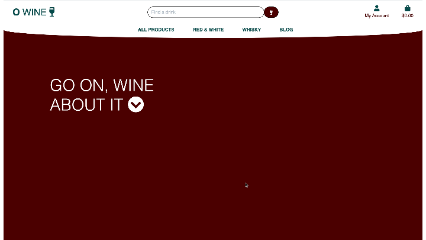
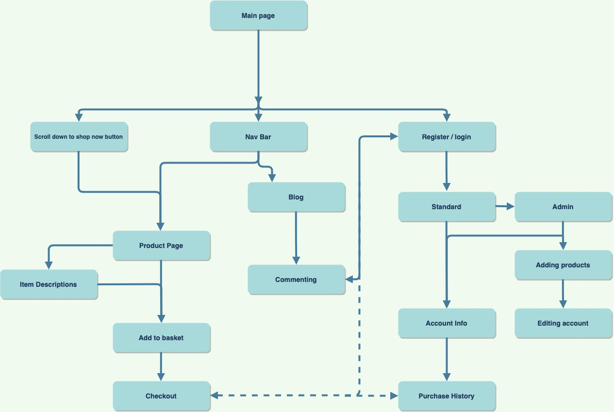
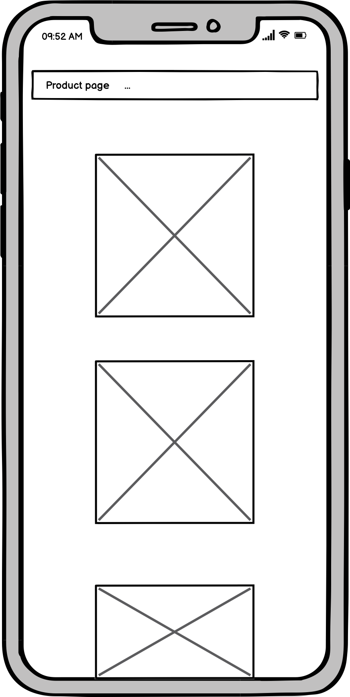
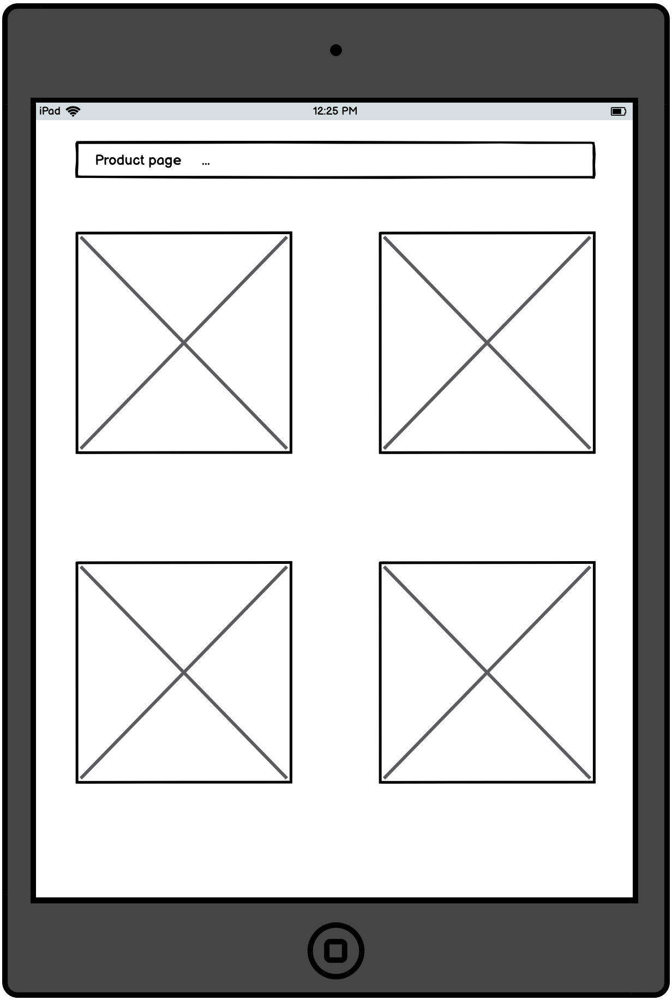
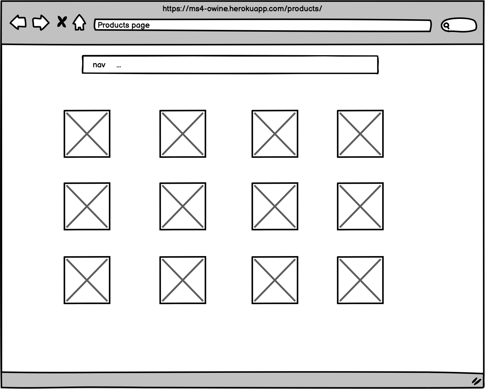

# MS4-oWine
A site to view and buy alcohol



## An Overview
For my final milestone project I have chosen to build a site to view and purchase alcohol. This project is built using HTML, CSS, Javascript, Python, Flask and Django. Show casing mobile first design, usage of multiple "apps" and also a backend framework to handle customer accounts, purchases and product management.
I decided on building a site for users to view and purchase wines and whisky, which also allows the site managers to manage inventory.

In this document I will go through what I've built and why, as well as future goals and testing that's been done to make sure this site is functional in what it offers as well as across multiple device types, from mobile to desktop.

View a live version of my site [here](https://ms4-owine.herokuapp.com/)

## Table of content
   * [UX](#ux) 
   * [UI](#ui)
   * [Objectives](#objectives)
      * [For The Site Owner](#for-the-site-owner)
      * [For The User](#for-the-user)
   * [Wireframe](#wireframe)
   * [Scope](#scope)
      * [Start](#start)
      * [Middle](#middle)
      * [Ongoing](#ongoing)
   * [User Stories](#user-stories)
   * [Technologies Used](#technologies-used)
   * [Feature and Technology Testing](#feature-and-technology-testing)
   * [Further Testing](#further-testing)
   * [Deployment](#deployment)
   * [Credits](#credits)

## UX
### The Experience:
I wanted to create a site which has minimalistic and clean look. It has a modern colour tone which is calming but reminds the user of the colours of red wine.
Corners are rounded on most UI elements and even the Navigation Bar at the top is separated from the top to create a different look, the aim to remind the user about a bottle.

### Journey of the Site:


As a new user, you’re greeted with a basic welcome screen which differs to other purchasing sites where it screams products at your face. This feels more subtle and friendly allowing users to explore on their own accord yet still being able to easily purchase items

You’re able to select different sections of the site via the nav bar which is present throughout the site no matter the screen size.

Item sections:
This is split into 2 main categories and 2 extra options. We have Wine and Whisky, then All products and the blog section. 
Whisky and Wine speaks for itself where it allows users to go through and view specific items in those categories. In the wine section you can dive deeper and split it into red or white wine
In the all categories section, you can sort items by price, categories, rating or just view all products. Allowing users to have further control of the site


Management section:
In an admin user, you can add and remove products from the standard webpage, however you can also dive further into the site in the “admin” option within Django, allowing users to add or remove blog posts, add multiple items to the site in easier succession and to manage user accounts as well

Blog:
* This blog section acts as a simple interactive way for users to talk about their purchases based on the author’s posts. It allows the site owner to engage with the users with Q&As and general posts.


### Colours:

#4b0000 - This is used as the primary colour of the site. It has a redness that is similar to red wine which is used to remind users about the site they’re on. This is also used for accent colours on top of white overlays, to bring the core colour through to the rest of the site.

	
#004B4B - Is used as a complementary colour to #4b0000, the green is close to a scottish green which ties in nicely to the whisky on the site as it's orignally from Scotland

#fff - is used for the rest of the site as a basic overlay colour. Which acts as a nice contrast to the base colour of the site


## UI 
### The Interface:

The site is built to be modern and mobile first. Its features are also supported across multiple browsers. This is shown in different parts of the site:

* The nav bar features a curved design where it's not completely flat at the bottom compared to  normal nav bars which typically are more flat. It is scalable and changes accordingly to device and screen size to what it shows.

* The blog section is treated like sticky notes on a white board. Scales between small and large screens to fit the comments proportionally 

The item sections have proportionate images which scale between device sizes and always gives the customer a clear view on what they’re purchasing

* Admin management and item added section supports different file type uploads, whether you’re adding images from a mobile device or desktop

* I opted for no footer for the site to make it a more flowing look, a "no ending" sort of look which is what customers want to wards the bottom of a bottle, they dont want it to end!


## Objectives
### For the Site Owner:
The main objective for the site owner is to introduce users to different types of wine and whisky and hope that they would see the curated selection of products and it temps them to purchase. With each new user, the blog section and the community style aspects will then hopefully keep engagement with the customer.
The blog section is also there to help customers interact with each other, sharing different tasting notes and each other’s experience with the drinks that they’ve tried / purchased.

All this is to help drive the community’s understanding on what they’re drinking and to also drive sales


### For the User:
For the user, I want to be able to see a new selection of drinks so when I’m due to purchase something new I can easily find something different to try. I want to be able to see what other people are talking about a certain drink before purchasing an item. Then after purchasing have the ability to talk to others about my thoughts

## Wireframe:
For my wireframes, I used Balsamiq Wireframes to mockup and create the site in different device sizes. Shown below are the different wireframes for Mobile, Tablet and Desktop. I started with the mobile site and worked from there to scale up the design. You can click on the image for a larger size.

Shown are the product page where most customer interactions are done as well as the comments page where customers can interact with one and other








## Accessibility
The site was built with accessibility needs in mind. 
   * Colours throughout the site offer contrast from on another to ensure easier readability
   * Tested with Lighthouse to improve and fix accessibility concerns

## Scope
### Start
At the planning stage of this project, I planned out the features that I wanted to implement and chose the colour scheme of the site. This was then plotted down on my wireframe to give a skeleton look of where everything would go.
Planning:
Site layout
Item adding
Item layout
Setting up Django

UI/UX:
* With the basic HTML skeleton I layered out
    * The base of the site, where items would sit and how they would scale

### Middle
After setting Django and the admin portal:
I was able to start adding items to my database
Imported individual photos and descriptions via the Django admin page
Then added the ability to add products directly from the site with an admin account
I was able to start adding blogs to my database
Commenting section was added for anyone with an account to comment
Was able to verify accounts for admin usage and verify emails
Email function was then added for users to verify their own email accounts with an email confirmation.
Similar email confirmation is used for emailing order details

### Ongoing
* For future ideas to add on for the different tier plans, I want to build:
    * Further expansion to blog
    * newsletter about new products

## User Stories
* As an Admin I expect to be able to:
    * Add new products
    * Edit products
    * add blog posts
    * Remove products 
    * Have a space where it's easy to use and understand

* As a user I expect to be able to:
   * Purchase products
   * Sign up for an account
   * See my orders
   * Sort through products in different ways
   * Comment on blogs

## Technologies used:
* HTML5
* CSS
* [Bootstrap](https://getbootstrap.com/) - for structure and extra features of the site
* [Fontawesome](https://fontawesome.com/)
* Javascript
   * [Jquery](https://jquery.com)
* Python
* Django
* [Flask](https://flask.palletsprojects.com/en/1.1.x/)
* [Jinja](https://jinja.palletsprojects.com/en/2.11.x/)
* [AWS](https://aws.amazon.com)
* Balsamiq
* SQLite

## Feature and Technology Testing

For Admin access to the page to assit with testing:

Username: owebster
Password: password

### Manual testing:
Each feature set was tested on mobile, medium and large screen, natively and also via developer inspection on Chrome and Safari.
Log in functionality
Create user functionality
Contact form
User interface and scalability of elements on site
Blog functionality
Individual log in functionality for users that are not admins


## Further Testing:
### HTML
All HTML code has gone through https://validator.w3.org/ and no errors occur

### CSS
All CSS was tested using direct input with https://jigsaw.w3.org and no errors were returned

### JS
All Javascript has been passed through https://jshint.com and no errors occurred

### Python
All python has been passed through http://pep8online.com/ and passed


### Chrome developer tools
When building the site, during each section I used Chrome's inspect and developer tools (such as lighthouse) to validate my work and to ensure the site worked across multiple screen sizes.
This was also used to debug any structural and styling issues on the fly

### Buttons and Links
All buttons and links have been accounted for and directs to the right source

### UI Testing
| UI Testing             |                  |              |
|------------------------|------------------|--------------|
| Large Screen - Desktop |                  | No UI issues |
|                        |                  |              |
| Phone:                 | iPhone X         | No UI issues |
|                        | iPhone 8Plus     | No UI issues |
|                        | iPhone 6         | No UI issues |
|                        | iPhone SE        | No UI issues |
|                        | Pixel 2          | No UI issues |
|                        | Galaxy Fold      | No UI issues |
|                        | Surface Duo      | No UI issues |
|                        |                  |              |
| Tablet:                | iPad             | No UI issues |
|                        | iPad Pro         | No UI issues |
|                        | iPad - Landscape | No UI issues |

## Deployment:
During this project, I made sure that I spent some of my time focusing on how to properly manage and deploy my project. I used the GitPod IDE, Github's desktop app and the IDE's terminal to create branches, test and deploy my code. I primarily did my work in my testing branch as I knew that I would commit to my main branch closer to the time I made my site public. Within the IDE:

I used the built in terminal to get git status, git add, git commits and git push:
For local deplpyment I ran:
```
python3 manage.py runserver
```
After deploying to heroku, I set it up so every push to github auto deloyed to heroku as well. Meaning after local testing, it would automatically push to production

Within Github's desktop app:

I used to push to github and change/create branches when I wanted to test out new features / layouts. An example of this was when I was creating the hero carousel and wanted to test how different screen sizes would affect the provided images

- Code has been published to github using git and terminal.
- Code history is managed via github as well.
- Site is deployed to heroku - https://ms4-owine.herokuapp.com

Within Heroku's deployment:
The config files used for this project:
- AWS_ACCESS_KEY_ID
- AWS_SECRET_ACCESS_KEY
- DATABASE_URL
- EMAIL_HOST_PASS
- EMAIL_HOST_USER
- STRIPE_PUBLIC_KEY
- STRIPE_SECRET_KEY
- STRIPE_WH_SECRET
- USE_AWS


## Credits:
   * [Bootstrap](https://getbootstrap.com/)
   * [ColorTools](https://www.colortools.net/color_complementary.html) for picking complementary and contrasting colours
   * My mentor Spencer for helping me along the way on my first project.
   * Code Institute tutors for helping with deployment and functionality issues
   * [Favicon](https://favicon.io/emoji-favicons/flag-wales/) for favicon generator
   * [W3School](https://www.w3schools.com/howto/howto_js_scroll_to_top.asp) for back to top button
   * Dev Ed on youtube for tutorial on Javascript
   * [Markdown Tables](https://www.tablesgenerator.com/markdown_tables) for generating markdown table template

### [Back to Top](#an-overview)

